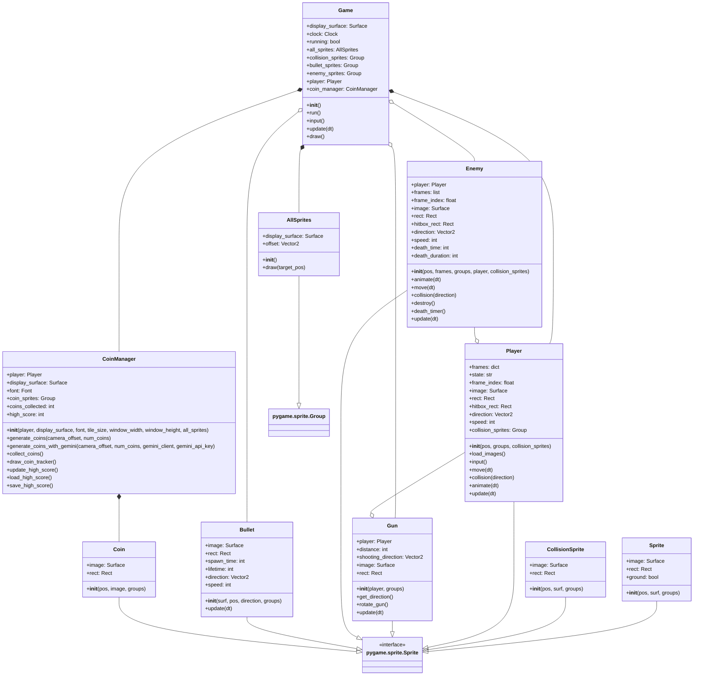

```mermaid
classDiagram
    %% Base Sprite Classes
    class pygame.sprite.Sprite {
        <<interface>>
    }
    class Sprite {
        +image: Surface
        +rect: Rect
        +ground: bool
        +__init__(pos, surf, groups)
    }
    class CollisionSprite {
        +image: Surface
        +rect: Rect
        +__init__(pos, surf, groups)
    }

    %% Player Related Classes
    class Player {
        +frames: dict
        +state: str
        +frame_index: float
        +image: Surface
        +rect: Rect
        +hitbox_rect: Rect
        +direction: Vector2
        +speed: int
        +collision_sprites: Group
        +__init__(pos, groups, collision_sprites)
        +load_images()
        +input()
        +move(dt)
        +collision(direction)
        +animate(dt)
        +update(dt)
    }

    class Gun {
        +player: Player
        +distance: int
        +shooting_direction: Vector2
        +image: Surface
        +rect: Rect
        +__init__(player, groups)
        +get_direction()
        +rotate_gun()
        +update(dt)
    }

    %% Enemy Related Classes
    class Enemy {
        +player: Player
        +frames: list
        +frame_index: float
        +image: Surface
        +rect: Rect
        +hitbox_rect: Rect
        +direction: Vector2
        +speed: int
        +death_time: int
        +death_duration: int
        +__init__(pos, frames, groups, player, collision_sprites)
        +animate(dt)
        +move(dt)
        +collision(direction)
        +destroy()
        +death_timer()
        +update(dt)
    }

    %% Projectile Classes
    class Bullet {
        +image: Surface
        +rect: Rect
        +spawn_time: int
        +lifetime: int
        +direction: Vector2
        +speed: int
        +__init__(surf, pos, direction, groups)
        +update(dt)
    }

    %% Coin Related Classes
    class Coin {
        +image: Surface
        +rect: Rect
        +__init__(pos, image, groups)
    }

    class CoinManager {
        +player: Player
        +display_surface: Surface
        +font: Font
        +coin_sprites: Group
        +coins_collected: int
        +high_score: int
        +__init__(player, display_surface, font, tile_size, window_width, window_height, all_sprites)
        +generate_coins(camera_offset, num_coins)
        +generate_coins_with_gemini(camera_offset, num_coins, gemini_client, gemini_api_key)
        +collect_coins()
        +draw_coin_tracker()
        +update_high_score()
        +load_high_score()
        +save_high_score()
    }

    %% Group Management Classes
    class AllSprites {
        +display_surface: Surface
        +offset: Vector2
        +__init__()
        +draw(target_pos)
    }

    %% Game Management Classes
    class Game {
        +display_surface: Surface
        +clock: Clock
        +running: bool
        +all_sprites: AllSprites
        +collision_sprites: Group
        +bullet_sprites: Group
        +enemy_sprites: Group
        +player: Player
        +coin_manager: CoinManager
        +__init__()
        +run()
        +input()
        +update(dt)
        +draw()
    }

    %% Inheritance Relationships
    Sprite --|> pygame.sprite.Sprite
    CollisionSprite --|> pygame.sprite.Sprite
    Player --|> pygame.sprite.Sprite
    Gun --|> pygame.sprite.Sprite
    Enemy --|> pygame.sprite.Sprite
    Bullet --|> pygame.sprite.Sprite
    Coin --|> pygame.sprite.Sprite
    AllSprites --|> pygame.sprite.Group

    %% Associations
    Game *-- Player
    Game *-- CoinManager
    Game *-- AllSprites
    CoinManager *-- Coin
    Game o-- Gun
    Game o-- Enemy
    Game o-- Bullet
    Player --o Gun
    Enemy --o Player
```
