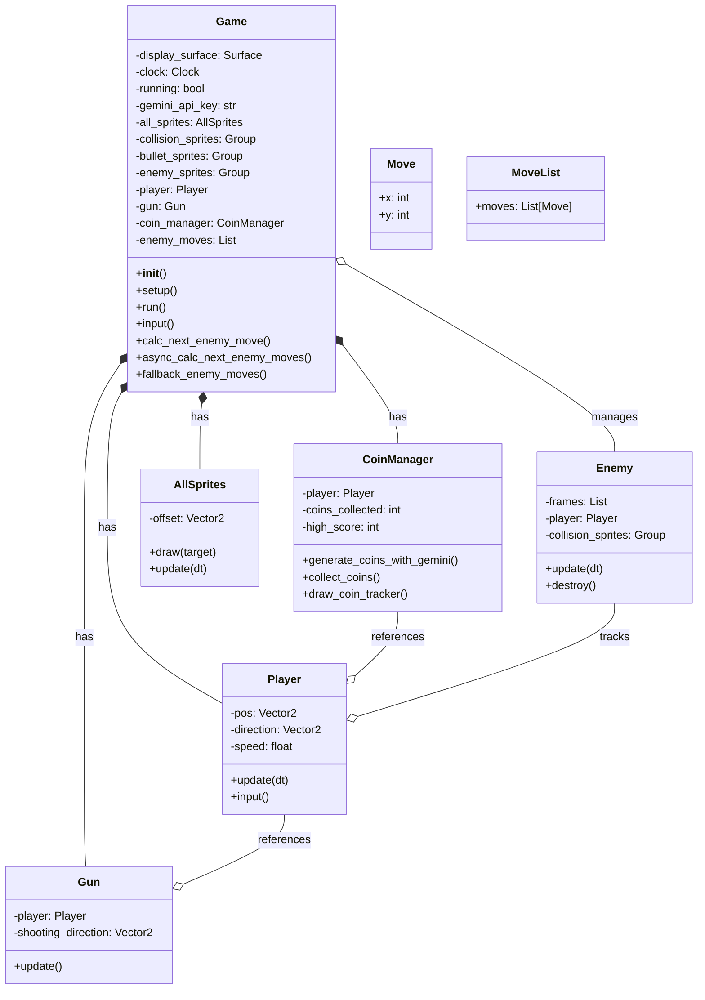

# System Context Diagram

```mermaid
C4Context
    title System Context Diagram - GenAI Game System
    
    %% Layout configuration
    direction LR
    
    %% Core components with spacing
    Person(player, "Player", "User interaction")
    
    System(game, "GenAI Game\nSystem", "Core game engine")
    
    System_Ext(gemini, "Google\nGemini API", "AI service")
    
    %% Storage components
    SystemDb_Ext(assets, "Asset\nStorage", "Game resources")
    
    SystemDb(local, "Local\nStorage", "Game state")
    
    %% Relationships with spacing
    Rel_R(player, game, "Input")
    Rel_L(game, player, "Output")
    
    Rel_R(game, gemini, "AI Requests")
    Rel_L(gemini, game, "Decisions")
    
    Rel_D(game, assets, "Load")
    Rel_D(game, local, "Save")
```

# Game System Class Diagram



## Class Relationships

- **Game**: Central controller class that manages all game components
- **Player**: Represents the player character with movement controls
- **Gun**: Handles shooting mechanics, attached to the player
- **Enemy**: AI-controlled opponents that chase the player
- **CoinManager**: Manages coin generation and collection system
- **Move/MoveList**: Data structures for AI movement calculations
- **AllSprites**: Custom sprite group for offset-based rendering

## Key Features

1. **AI Integration**
   - Enemy movement calculation via Gemini API
   - Coin placement using AI suggestions
   - Fallback systems for API failures

2. **Game Mechanics**
   - Shooting system
   - Collision detection
   - Score tracking
   - Enemy spawning

3. **Technical Features**
   - Asynchronous API calls
   - Rate limiting protection
   - Thread management
   - State management
